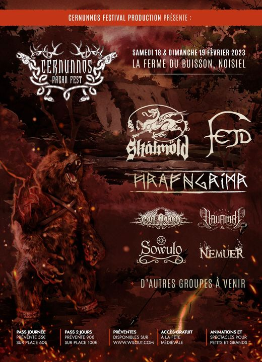

 NEW DATES 2023  TICKET 2023  GROUP ANNOUNCEMENT

The whole team is happy to announce that the next Cernunnos Pagan Fest will take place on Saturday 18 February and Sunday 19 February 2023 still at [la Ferme du Buisson](https://www.facebook.com/fermedubuisson/?__cft__[0]=AZWAwtALMyEccJMDXsDGRF99zFskEqS4rvuxNA17l-pXgoW9kEpRD9uHUC6o4kOWeRxwJ4Bd4doKjxquQsUyUZW-w8GYe_9PAUBmlKpqHXsYwR1iOkSIaf8uh38fnu6AUErqAEwDm2WMLNHDgnKpNDIRTIgXQ00Ljr_X71B3hI2Ey-VdNaLFTsNrwq4BVWJI6aTHxfiMOslriHFSbRVx-U77YEPaWqsCeJ52KcN9OhZAIi0ns9ky4B4HCrRsMd0ZGis&__tn__=kK-y-R) A majority of the groups scheduled for 2022 trusted us and will be there next year. Here are the top 7: [Skálmöld](https://www.facebook.com/skalmold?__cft__[0]=AZWAwtALMyEccJMDXsDGRF99zFskEqS4rvuxNA17l-pXgoW9kEpRD9uHUC6o4kOWeRxwJ4Bd4doKjxquQsUyUZW-w8GYe_9PAUBmlKpqHXsYwR1iOkSIaf8uh38fnu6AUErqAEwDm2WMLNHDgnKpNDIRTIgXQ00Ljr_X71B3hI2Ey-VdNaLFTsNrwq4BVWJI6aTHxfiMOslriHFSbRVx-U77YEPaWqsCeJ52KcN9OhZAIi0ns9ky4B4HCrRsMd0ZGis&__tn__=-]K-y-R) [Cân Bardd](https://www.facebook.com/CanBardd?__cft__[0]=AZWAwtALMyEccJMDXsDGRF99zFskEqS4rvuxNA17l-pXgoW9kEpRD9uHUC6o4kOWeRxwJ4Bd4doKjxquQsUyUZW-w8GYe_9PAUBmlKpqHXsYwR1iOkSIaf8uh38fnu6AUErqAEwDm2WMLNHDgnKpNDIRTIgXQ00Ljr_X71B3hI2Ey-VdNaLFTsNrwq4BVWJI6aTHxfiMOslriHFSbRVx-U77YEPaWqsCeJ52KcN9OhZAIi0ns9ky4B4HCrRsMd0ZGis&__tn__=-]K-y-R) [HAVAMAL](https://www.facebook.com/Havamalofficial/?__cft__[0]=AZWAwtALMyEccJMDXsDGRF99zFskEqS4rvuxNA17l-pXgoW9kEpRD9uHUC6o4kOWeRxwJ4Bd4doKjxquQsUyUZW-w8GYe_9PAUBmlKpqHXsYwR1iOkSIaf8uh38fnu6AUErqAEwDm2WMLNHDgnKpNDIRTIgXQ00Ljr_X71B3hI2Ey-VdNaLFTsNrwq4BVWJI6aTHxfiMOslriHFSbRVx-U77YEPaWqsCeJ52KcN9OhZAIi0ns9ky4B4HCrRsMd0ZGis&__tn__=kK-y-R)

2022 tickets remain valid for the next edition and you have done well to keep them as we have been forced to increase ticket fares 2023.

The 2 day pass will be €90 in pre-sale and €100 on site

The 1-day pass will be €55 pre-sale and €60 on site

You can purchase your 2023 tickets by going to our website:

[www.cernunnospaganfest.fr](https://www.cernunnospaganfest.fr/?fbclid=IwAR0CfqZPXtlZnYaqpC0aoRXZ4fG_SYDPtTX82cDpK8ICZNcrSFrdvZ2GpXw)

