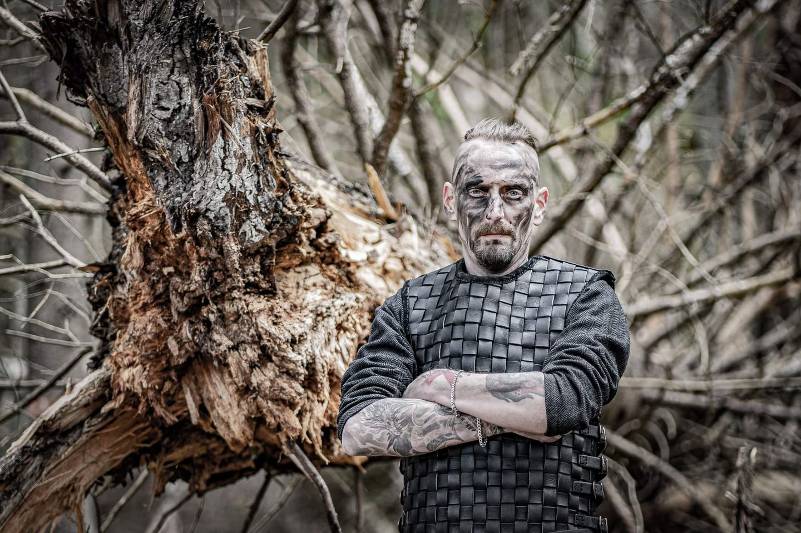

Einherjars and Valkyries of Odins wisdom, heed!

Another friday, another day to get to know one of our hymn-weavers in spirit and mind!

Our story for today will delve into the depths of our blood-brother and axe-wielder Kjell!

If you have any other questions for him, feel free to bombard the comments below.

Name: Kjell

**Instrument:**

Guitar

**Gear:**

The most important part of my setup is definitely my Gibson 50th Anniversary Flying V from 2008. Apart from that I have a couple of Solars as backup.

As for amps and cabs I use a Peavey 6505 head, and Marshall 2551AV cabs.

As any guitar-nerd with any sort of self-respect I use a wide arrange of pedals and effects (too many?) as well!

**Your biggest influences or inspirations?**

This is a tricky question, as I think it's hard to pinpoint where my influences comes from. Overall I just think i listen to my favorite bands and draw inspiration from them. As for orchestral parts it has to be Two Steps From Hell!

**Your favourite bands? Metal and nonmetal!**

There are just so many great bands out there! Also, it varies so much over time, but some bands that have stayed with me for a really long time are Shade Empire, Kamelot, Blind Guardian, Judas Priest, Dark Tranquility, and so many more!

When I'm not listening to metal I usually listen to orchestral music like movie soundtracks, or lately i have been kinda into traditional nordic instrumental music! Great for relaxing!

**What hobbies, apart from music, do you have?**

I don't really have much of a life apart from music! But I am a historian so i do take some pleasure in reading about old cultures and there are just so many cool stories about the past. Im also a huge fan of binge watching TV-series, and who says no to some good old fashioned video games?

**In Norse mythology, which is your favourite character and story?**

The norse mythology is such a treasure when it comes to characters, but I think I have to go with Loke. It's just so refreshing with a cool villain, that you never know what he is gonna do. He is involved in loads of kickass stories, but the drama when he is finally captured and tortured by the gods might just beat them all.

**What are you listening to right now?**

Right now I am listening to Equilibriums new single XX. Awesome single!

**Which is your preferred poison?**

I'm all about the beer! I'm not very fancy in my choice, but rather go for quantity over quality! The more the better!

**Which is your dream concert to play?**

The most obvious one would be Wacken, but not far behind comes 70 000 tons of metal. Hopefully one day we can all raise our horns together at one of those!

**Anything you want to add?**

I want to thank all the people out there listening to and appreciating our music! All the great response from you guys are what makes this so awesome! Thank you!

Also a huge shootout to the brothers in the band, best people one can wish for!

Hope to see you all on the road soon! Hail Havamal!

Photo: Tobias Myllynen

