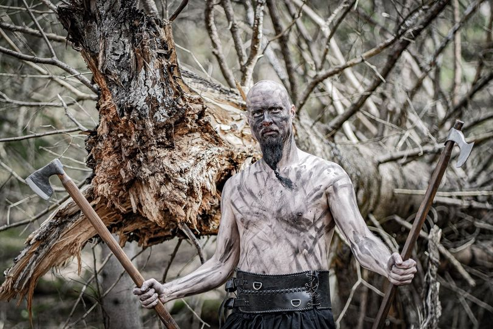

Heed Valkyries and Einherjars! It is Friday again, and that means that it is time to finish our series of getting to know the members of Havamal!

Last but not least, we give you our warrior brother Lennie!

Don't forget, ask him anything you like in the comments below!

**Name: Lennie**

**Instrument:**

Guitar and keyboard

**Gear:**

My setup is my Gibson Flying V Custom as my main guitar, and my white Gibson Explorer as a backup. Sometimes i also use ESP SV and an ESP M2 when I need a guitar with a whammy bar.

Guitar pickups I use are DiMarzio tone on the Flying V, and EMG 81 and 85 on the Explorer.

My guitar amp is an Engl Invader 150 with a Marshall Cab, and various pedals like Ibanez Tubescreamer and Boss Delay with MXR delay.

**Your biggest influences or inspirations?**

My main inspirations comes from Finland, with bands like Turisas, Ensiferum and Nightwish. But I also find inspiration in movie soundtracks, musicals and classical music., as well as some 80s rock like Yngwie and Gary Moore!

**Your favourite bands? Metal and nonmetal!**

Some of my favorite bands are Children of Bodom, Running Wild, Stratovarius, Yngwie Malmsteen and Ensiferum. But apart from the metal genre I´m a huge fan of more modern composers like Hans Zimmer and Thomas Bergersen!

**What hobbies, apart from music, do you have?**

American muscle cars!

**In Norse mythology, which is your favourite character and story?**

Loke! And my favourite story is when Loke and Tor are competing with the giants in different activities, like drinking and wrestling!

**What are you listening to right now?**

Omnium gatherum latest album!

**Which is your preferred poison?**

Wine!

**Which is your dream concert to play?**

Wacken open air is of course a dream concert, but also Sabaton open air and Sweden rock would be awesome. Actually, all open air festivals are great!

**Anything you want to add?**

I would like to thank all all of our fans that has supported us over the year! You are the ones that have inspired us! Huge thanks to all of you!

Photo: \[Tobias Myllynen](https://www.facebook.com/tobias.myllynen/)

