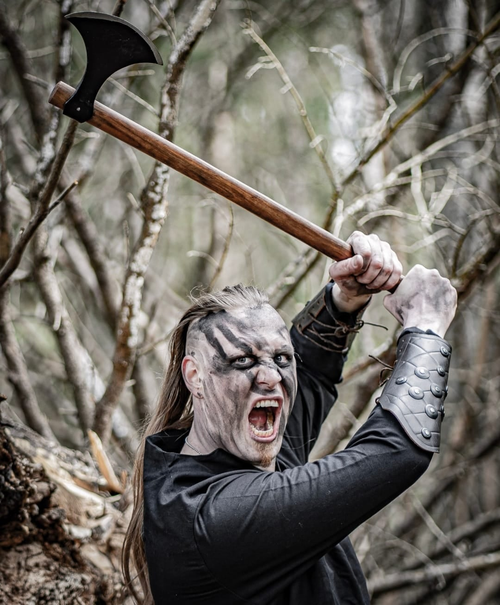

<!--StartFragment-->

Einherjars and Valkyries of Odins wisdom, heed!

It is friday, and that means that it is high time to continue our series of getting to know more about the members of Havamal! This week, the time has come to meet the voice and beast behind the microphone: Björn!

Don´t forget to ask Björn anything you like in the comments below!

Name:

\- Björn Larsson

Instrument:

\- Vocals

Gear:

\- Shure SM58, Shure SM7B, Sennheiser E835, Sennheiser reciever and transmittor.

Your biggest influences or inspirations?

\- Devin Townsend, Alexi Laiho, Petri Lindroos, Christian Älvestam, Chris Valagao

Your favourite bands? Metal and nonmetal!

\- Children of Bodom, Equilibrium, Finntroll, Norther, Tenacious D, Dr Bombay and a lot more depending on the mood.

What hobbies, apart from music, do you have?

\- Workout, reading, gaming, world studies, my dog.

In Norse mythology, which is your favourite character and story?

\- My favourite story and character is intertwined in Loki and Thor on their journey to Utgaard or Utgård. It's such an epic metaphorical journey with a lot of twists and grand tales for eons to come. It also proves that the good guys does not always win, so they beat George R.R. Martin to the chase!

What are you listening to right now?

\- As mentioned it depends on the mood, but for now mostly Imperanon, Moonsorrow, RainbowDragonEyes and my favourite podcast Parcast Mythology.

Which is your prefered poison?

\- You can't go wrong with Staropramen and Elk!

Which is your dream concert to play?

\- Dalhalla, with a followup listening experince of Wardruna and Heilung.

Anything you want to add?

\- A thousand bloodied thanks to all of our warriors out there that makes this possible! You keep the pagan flame burning and I hope that We can continue this unholy crusade for many years to come! Hail all of you, and hail Havamal!

